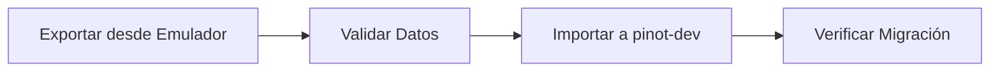
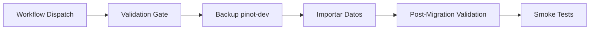

# Guía de Migración de Datos a pinot-dev

Esta guía explica cómo migrar datos de Firestore desde fuentes locales (emuladores o archivos JSON) hacia el proyecto Firebase `pinot-dev`, siguiendo las prácticas DevOps establecidas.

## 📋 Tabla de Contenidos

- [Prerrequisitos](#prerrequisitos)
- [Flujo de Migración](#flujo-de-migración)
- [Migración Local](#migración-local)
- [Migración con CI/CD](#migración-con-cicd)
- [Estrategias de Conflicto](#estrategias-de-conflicto)
- [Troubleshooting](#troubleshooting)

## Prerrequisitos

### Configuración Local

1. **Firebase CLI instalado y autenticado**:
   ```bash
   npm install -g firebase-tools
   firebase login
   ```

2. **Dependencias del proyecto**:
   ```bash
   pnpm install
   ```

3. **Emuladores de Firebase** (si migras desde emuladores):
   ```bash
   firebase emulators:start --only firestore
   ```

### Configuración en GitHub

1. **GitHub Secrets configurados**:
   - `FIREBASE_TOKEN_DEV`: Token de CI para pinot-dev

2. **Environment Protection**:
   - El environment `dev` debe tener protección configurada para aprobación manual (opcional pero recomendado)

## Flujo de Migración

### Opción 1: Migración Local (Recomendado para pruebas)



### Opción 2: Migración con CI/CD (Recomendado para producción)



## Migración Local

### Paso 1: Exportar desde Emulador

Si tienes datos en emuladores locales:

```bash
# Iniciar emuladores
firebase emulators:start --only firestore

# En otra terminal, exportar datos
pnpm run migrate:export --emulator

# O especificar ruta de salida
pnpm run migrate:export --emulator --output ./my-migration-data.json
```

Esto creará un archivo `migration-data.json` con todos los datos exportados.

### Paso 2: Validar Datos

Antes de importar, valida la estructura de los datos:

```bash
pnpm run migrate:validate --source=json --path=./migration-data.json
```

Este comando:
- ✅ Valida estructura de documentos
- ✅ Verifica campos requeridos
- ✅ Valida tipos de datos
- ✅ Genera reporte de validación

**Si la validación falla, corrige los errores antes de continuar.**

### Paso 3: Importar a pinot-dev

```bash
# Importar todas las colecciones
pnpm run migrate:import \
  --project=pinot-dev \
  --source=json \
  --path=./migration-data.json \
  --strategy=skip

# Importar colecciones específicas
pnpm run migrate:import \
  --project=pinot-dev \
  --source=json \
  --path=./migration-data.json \
  --collections=eventos,participantes \
  --strategy=overwrite
```

### Paso 4: Verificar Migración

Después de importar, verifica que los datos se importaron correctamente:

```bash
pnpm run migrate:verify \
  --project=pinot-dev \
  --path=./migration-data.json
```

### Flujo Completo

```bash
# Exportar, validar e importar en un solo comando
pnpm run migrate:full
```

## Migración con CI/CD

### Usar GitHub Actions Workflow

1. **Ir a GitHub Actions**:
   - Navega a tu repositorio en GitHub
   - Ve a la pestaña "Actions"
   - Selecciona "Migrate Data to Dev"

2. **Ejecutar Workflow**:
   - Haz clic en "Run workflow"
   - Completa los parámetros:
     - **Source type**: `json` o `emulator`
     - **JSON path**: Ruta al archivo JSON (si source_type=json)
     - **Collections**: Lista separada por comas (vacío = todas)
     - **Conflict strategy**: `overwrite`, `merge`, o `skip`

3. **Aprobación Manual** (si está configurada):
   - Espera a que el job `validate` complete
   - Revisa el reporte de validación
   - Aprueba el job `migrate` si todo está correcto

4. **Revisar Resultados**:
   - Revisa los artifacts generados
   - Verifica el reporte de migración
   - Confirma que los smoke tests pasaron

### Subir Archivo JSON a GitHub

Si necesitas migrar desde un archivo JSON:

1. **Subir archivo al repositorio** (temporalmente):
   ```bash
   git add migration-data.json
   git commit -m "chore: add migration data"
   git push
   ```

2. **Ejecutar workflow** con `json_path` apuntando al archivo

3. **Eliminar archivo después de migrar**:
   ```bash
   git rm migration-data.json
   git commit -m "chore: remove migration data"
   git push
   ```

## Estrategias de Conflicto

### `skip` (Por defecto)

No sobrescribe documentos existentes. Útil para migraciones incrementales.

```bash
--strategy=skip
```

**Uso**: Cuando quieres agregar solo documentos nuevos sin modificar existentes.

### `overwrite`

Sobrescribe documentos existentes con los datos importados.

```bash
--strategy=overwrite
```

**Uso**: Cuando quieres reemplazar completamente los datos existentes.

⚠️ **Advertencia**: Esta estrategia puede eliminar datos existentes. Úsala con precaución.

### `merge`

Combina datos existentes con datos importados. Los campos del import tienen prioridad.

```bash
--strategy=merge
```

**Uso**: Cuando quieres actualizar documentos existentes manteniendo campos no conflictivos.

## Colecciones Migradas

Las siguientes colecciones se migran por defecto:

- `anfitriones`
- `eventos`
- `participantes`
- `etiquetas`
- `selecciones`
- `membresias`
- `usuarios`
- `plantillasParticipantes`
- `plantillasEtiquetas`
- `fcmTokens`
- `admin_config`
- `admin_logs`
- `registros_pendientes`
- `oauth_states`

## Troubleshooting

### Error: "Migration data file not found"

**Causa**: El archivo JSON no existe en la ruta especificada.

**Solución**:
```bash
# Verificar que el archivo existe
ls -la migration-data.json

# Usar ruta absoluta si es necesario
pnpm run migrate:validate --source=json --path=/ruta/absoluta/migration-data.json
```

### Error: "Validation failed"

**Causa**: Los datos no cumplen con la estructura esperada.

**Solución**:
1. Revisa el reporte de validación: `migration-validation-report.json`
2. Corrige los errores reportados
3. Vuelve a validar

### Error: "Permission denied" al importar

**Causa**: No tienes permisos para escribir en pinot-dev.

**Solución**:
1. Verifica que estés autenticado: `firebase login`
2. Verifica que tengas acceso al proyecto: `firebase projects:list`
3. Usa el token correcto en CI/CD

### Error: "Checksum mismatch"

**Causa**: El archivo JSON fue modificado después de exportar.

**Solución**:
1. Re-exporta los datos desde el emulador
2. O acepta el warning si sabes que modificaste el archivo intencionalmente

### Smoke Tests Fallan

**Causa**: El sitio no responde después de la migración.

**Solución**:
1. Verifica que pinot-dev.web.app esté accesible manualmente
2. Revisa los logs de Firebase Hosting
3. Verifica que no haya errores en la consola del navegador

## Mejores Prácticas

1. **Siempre valida antes de importar**: Usa `migrate:validate` antes de `migrate:import`

2. **Haz backup antes de importar**: El workflow de CI/CD crea backups automáticamente

3. **Usa estrategia `skip` por defecto**: Evita sobrescribir datos accidentalmente

4. **Migra colecciones específicas primero**: Prueba con una colección pequeña antes de migrar todo

5. **Revisa los reportes**: Siempre revisa los artifacts generados en GitHub Actions

6. **Verifica después de migrar**: Usa `migrate:verify` para confirmar que todo se importó correctamente

## Ejemplos de Uso

### Migrar solo eventos y participantes

```bash
pnpm run migrate:import \
  --project=pinot-dev \
  --source=json \
  --path=./migration-data.json \
  --collections=eventos,participantes \
  --strategy=skip
```

### Migrar todo sobrescribiendo datos existentes

```bash
pnpm run migrate:import \
  --project=pinot-dev \
  --source=json \
  --path=./migration-data.json \
  --strategy=overwrite
```

### Validar datos antes de migrar

```bash
# Validar
pnpm run migrate:validate --source=json --path=./migration-data.json

# Si pasa, importar
pnpm run migrate:import \
  --project=pinot-dev \
  --source=json \
  --path=./migration-data.json \
  --strategy=skip
```

## Referencias

- [Firebase Admin SDK Documentation](https://firebase.google.com/docs/admin/setup)
- [Firestore Data Export/Import](https://firebase.google.com/docs/firestore/manage-data/export-import)
- [GitHub Actions Workflows](../.github/workflows/migrate-data-to-dev.yml)

